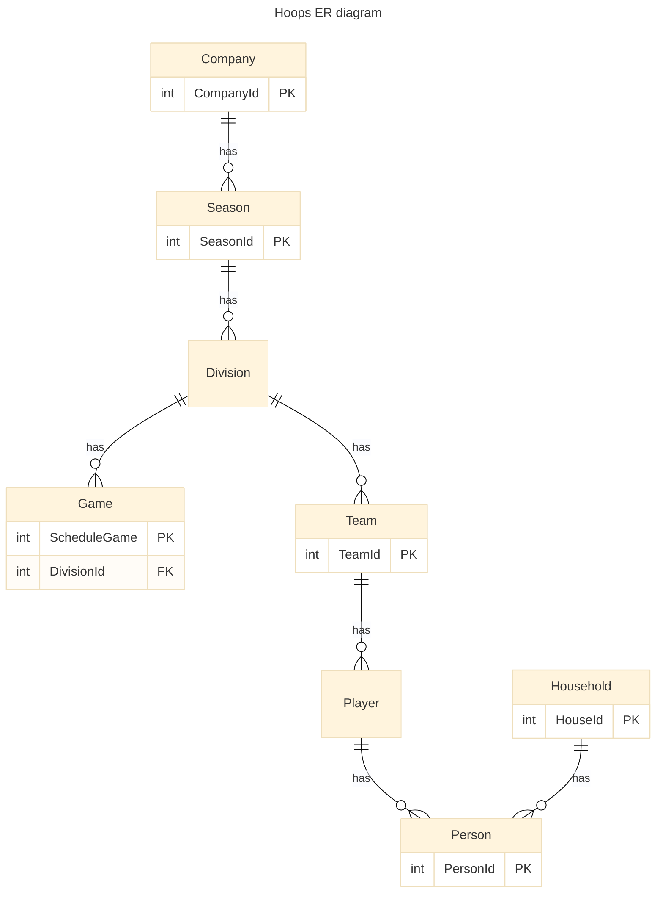

# Architecture Overview

## Purpose

This document provides a high-level view of the application architecture, covering its modular structure, technology stack, security layers, and domain modeling principles.

## System Design Principles

- **Modularity**: Logical separation of concerns by feature domain (e.g., people, leagues, scheduling)
- **Security-First**: Route and API guardrails to enforce role-based access control
- **Consistency**: Shared coding standards and data patterns across all modules
- **Testability**: Unit and integration tests enforced at merge via CI/CD workflows
- **Scalability**: Infrastructure designed to grow with increasing teams, data, and processing

## Application Layers

### 🖥️ Frontend (Angular)

- Feature Modules (e.g., `admin-people`, `admin-games`, `team-management`)
- Route Guards for admin access control
- Environment-based API config injection
- Reusable UI components (e.g., person-card, household-summary)
- Production uses app service for front end, Develop environment uses static web pages. We'd like to standardize on this in next deployment.
- Use Angular Material for visual components
- Use Tailwind CSS for html formatting
- Transitioning from using ngrx to using Signals in services for state managements

### 🌐 API Layer (.NET)

- RESTful endpoints organized by aggregate roots
- Policy-based authorization (`[Authorize(Roles = "Admin")]`)
- DTO mappers for separation from persistence models
- Input validation (FluentValidation, attributes)

### 🧠 Domain & Data

- Core entities: `Person`, `Household`, `Season`, `Division`, `Team`, `Game`, `Playoff Game`
- Relationships:
  - `Person` ↔ `Household`: many-to-one
  - `Person` ↔ `Season`: one-to-many
  - `Person` ↔ `Player`: one-to-many
- SQL Server with EF Core ORM
- Audit fields: createdBy, updatedBy, timestamps

## Diagram

### Testing UI-Driven Filtering Components

- Prefer testing state changes and DOM updates over internal methods.
- Use `fixture.detectChanges()` after interactions that affect the DOM.
- Where interaction triggers service updates, spy and assert on service methods.

### 🔐 Security Considerations

- Role-based access implemented at UI route and API endpoint levels
- Protected configuration via Azure Key Vault
- JWT-based authentication with refresh token rotation

### ☁️ Infrastructure

- Azure App Services + SQL Server instance
- Bicep or Terraform defined resource groups and identity policies
- Dev/test/prod environment separation with unique secrets

### 🔄 CI/CD Pipelines

- GitHub Actions trigger on PRs and merges
- Test and linting gates
- Infrastructure linting and preview planning for IaC

## Next Steps

- Document `team-scheduler` and `game-results` modules
- Define event-driven interactions (e.g., when a person is deleted, cascade update)
- Expand test coverage and architecture validation tooling
