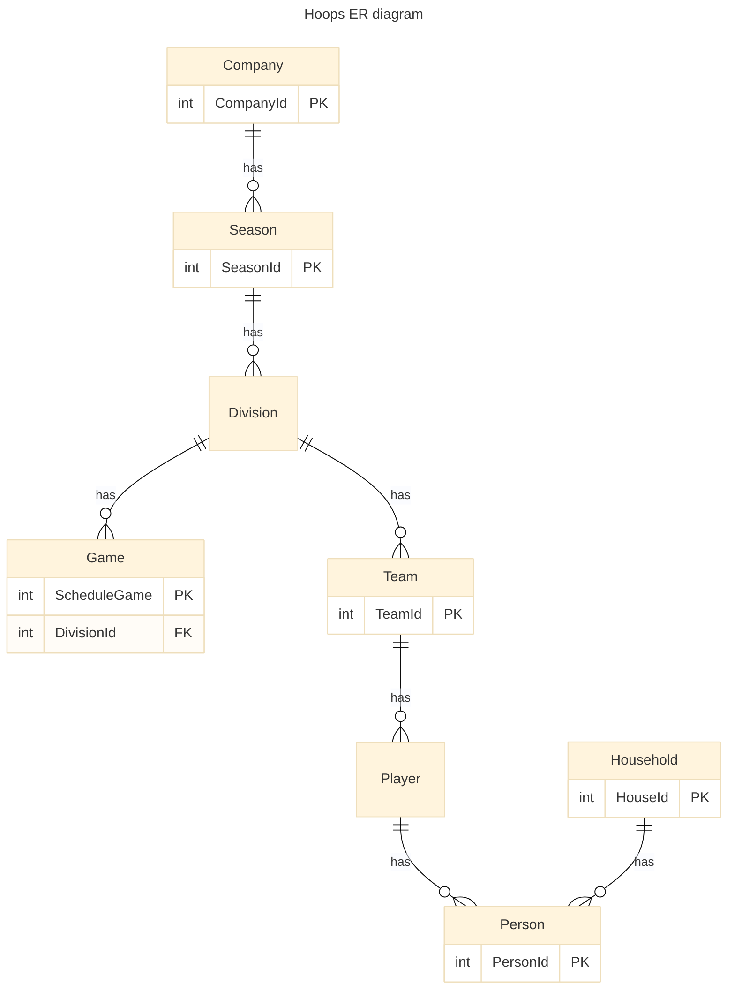
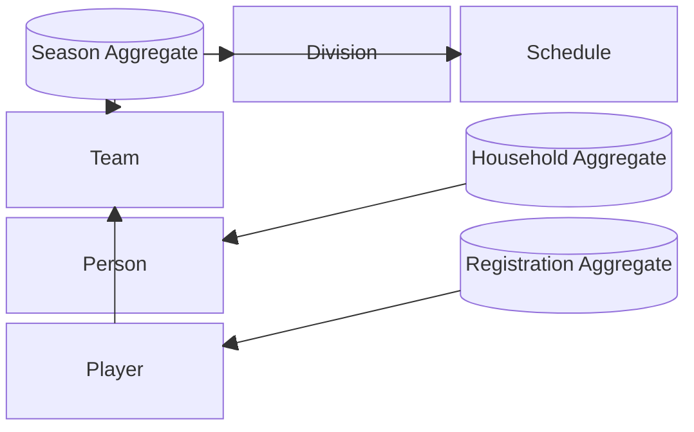

# Architecture Overview

## Purpose

This document provides a high-level view of the application architecture, covering its modular structure, technology stack, security layers, and domain modeling principles.

## System Design Principles

- **Modularity**: Logical separation of concerns by feature domain (e.g., people, leagues, scheduling)
- **Security-First**: Route and API guardrails to enforce role-based access control
- **Consistency**: Shared coding standards and data patterns across all modules
- **Testability**: Unit and integration tests enforced at merge via CI/CD workflows
- **Scalability**: Infrastructure designed to grow with increasing teams, data, and processing

## Application Layers

### 🖥️ Frontend (Angular)

- Feature Modules (e.g., `admin-people`, `admin-games`, `team-management`)
- Route Guards for admin access control
- Environment-based API config injection
- Reusable UI components (e.g., person-card, household-summary)
- Production uses app service for front end, Develop environment uses static web pages. We'd like to standardize on this in next deployment.
- Use Angular Material for visual components
- Use Tailwind CSS for html formatting
- Transitioning from using ngrx to using Signals in services for state managements

### 🌐 API Layer (.NET)

- RESTful endpoints organized by aggregate roots
- Policy-based authorization (`[Authorize(Roles = "Admin")]`)
- DTO mappers for separation from persistence models
- Input validation (FluentValidation, attributes)

### 🧠 Domain & Data

- Core entities: `Person`, `Household`, `Season`, `Division`, `Team`, `Game`, `Playoff Game`
- Relationships:
  - `Person` ↔ `Household`: many-to-one
  - `Person` ↔ `Season`: one-to-many
  - `Person` ↔ `Player`: one-to-many
- SQL Server with EF Core ORM
- Audit fields: createdBy, updatedBy, timestamps

## Diagram

  
### Testing UI-Driven Filtering Components

- Prefer testing state changes and DOM updates over internal methods.
- Use `fixture.detectChanges()` after interactions that affect the DOM.
- Where interaction triggers service updates, spy and assert on service methods.

### 🔐 Security Considerations

- Role-based access implemented at UI route and API endpoint levels
- Protected configuration via Azure Key Vault
- JWT-based authentication with refresh token rotation

### ☁️ Infrastructure

- Azure App Services + SQL Server instance
- Bicep or Terraform defined resource groups and identity policies
- Dev/test/prod environment separation with unique secrets

### 🔄 CI/CD Pipelines

## Testing Strategy

### Backend (.NET)

- **Test Framework:** xUnit is used for all backend unit and integration tests.
- **Test Project Structure:**
  - All backend test projects are located under the `tests/` folder (e.g., `tests/Hoops.Api.Tests`, `tests/Hoops.Infrastructure.Tests`).
  - Each repository in `src/Hoops.Infrastructure/Repository` has a corresponding test class named `{RepositoryName}Test.cs` in `tests/Hoops.Infrastructure.Tests`.
- **Patterns:**
  - Use EF Core's in-memory database for most repository tests to simulate data access.
  - Use a shared `TestDatabaseFixture` for setup/teardown and to avoid code duplication.
  - Follow Arrange-Act-Assert in all test methods.
  - Use `[Fact]` for single-case tests and `[Theory]` for parameterized tests.
  - Mock dependencies only when necessary (e.g., for logging or external services).
- **Coverage:**
  - All CRUD operations and custom repository methods should have unit tests.
  - Integration tests should cover real data scenarios where possible.

### Frontend (Angular)

- **Test Framework:** Jasmine (with Karma runner) is used for all Angular unit tests.
- **Test File Location:**
  - Frontend tests are colocated with their components/services as `.spec.ts` files in `hoops.ui/src/app`.
- **Patterns:**
  - Use Angular TestBed for component and service tests.
  - Prefer testing observable state changes and DOM updates over internal implementation details.
  - Use spies to assert service interactions.
  - Use `fixture.detectChanges()` after actions that affect the DOM.
- **Coverage:**
  - All components, services, and pipes should have unit tests.
  - Integration tests should cover key user flows and state management logic.

### General Conventions

- Test class and file names should match the class/component under test.
- Use clear, descriptive test method names.
- Keep tests isolated and repeatable.
- All tests must pass before merging to main branches (enforced by CI).

### CI/CD Integration

- All tests are run automatically in CI pipelines (GitHub Actions).
- Test failures block merges to protected branches.

---
## Next Steps

- Document `team-scheduler` and `game-results` modules
