# User-schema

- Users are a table with people that may have privileges when authenticated
- There is a link to the People and Household tables with the PeopleID and HouseID fields, respectively
- the UserType field designates the type of role defined in the UserType class enum { Player = 0, Coach = 1, AD = 2, BoardMember = 3 };
- The DirectorID field links to the PeopleID in the People table. 

```mermaid

---
title: User-schema
---
erDiagram
    USERS {
        int UserId
        int CompanyID FK
        string UserName
        string Name
        string PWord
        int UserType
        int ValidationCode
        int PeopleID FK
        int HouseID FK
        datetime CreatedDate
        string CreatedUser
    }
    PEOPLE {
        int PeopleID PK
        int CompanyID FK
        int MainHouseID FK
        string FirstName
        string LastName
        string WorkPhone
        string Cellphone
        string email
        bit Suspended
        string LatestSeason
        string LatestShirtSize
        string LatestRating
        dateTime BirthDate
        bit BC 
        string Gender
        string SchoolName
        int Grade
        int GiftedLevelsUP
        bit FeeWaived
        bit Player
        bit Parent
        bit Coach
        bit AsstCoach
        bit BoardOfficer
        bit BoardMember
        bit AD        
        bit Sponsor
        bit SignUps
        bit Tryouts
        bit TeeShirts
        bit Printing
        bit Equipment
        bit Electrician
        dateTime CreatedDate
        string CreatedUser
        int TEMPID
    }
    HOUSEHOLDS {
        int HouseID PK
        int CompanyID FK
        string Name
        string Phone
        string Address1
        string Address2
        string City
        string State
        string Zip
        String Email
        bit EmailList
        string SportsCard
        int Guardian
        bit FeeWaived
        dateTime CreatedDate
        string CreatedUser
        int TEMPID
    }
    DIVISIONS {
        int DivisionID PK
        int CompanyID FK
        int SeasonID FK
        string Div_Desc
        int DirectorID FK
        int CoDirectorID FK
        string Gender
        dateTime MinDate
        dateTime MaxDate
        string Gender2
        dateTime MinDate2
        dateTime MaxDate2
        string DraftVenue
        DateTime DraftDate
        DateTime DraftTime
        bit Stats
        dateTime CreatedDate
        string CreatedUser
    }
    COMPANIES {
        int CompanyID PK
        string CompanyName
        int TimeZone
        string ImageName
        string EmailSender
        dateTime CreatedDate
        string CreatedUser
    }
    USERS ||--o| PEOPLE : has
    USERS ||--o| HOUSEHOLDS: allows
    PEOPLE ||--o| HOUSEHOLDS: has
    DIVISIONS ||--o| PEOPLE: allows
    HOUSEHOLDS ||--|| COMPANIES: has
    PEOPLE ||--|| COMPANIES: has
    USERS ||--|| COMPANIES: has
    DIVISIONS ||--|| COMPANIES: has 

```

