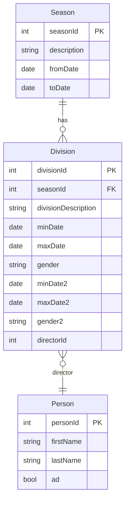

# Admin Divisions - Stories, Rules, Schema, and Design

This document reverse-engineers the current Admin Divisions feature set and captures intended behavior, contracts, and design. It serves as a living spec for ongoing work.

## Overview

Manage Divisions for a selected Season. Users can:

- Switch Seasons and see that Season’s Divisions
- Create or edit a Division (description, min/max birth dates per gender, optional second gender block, Director)
- Navigate to Teams for a Division

Tech:

- Frontend: Angular (standalone), Angular Material, Signals, Reactive Forms
- Backend: ASP.NET Core 9 Web API, EF Core

## User Stories

1. As an admin, I can pick a Season and see its divisions.
2. As an admin, I can add a Division for the active Season.
3. As an admin, I can edit a Division and keep it associated to its Season.
4. As an admin, I can assign or clear a Director from a list of ADs, and see it prefilled when editing.
5. As an admin, after saving a Division, the list reflects my changes.

## Business Rules

- Division description is required.
- Gender1 is required; Gender2 is only required if Min/Max Date 2 is provided.
- Min/Max dates must be valid and Min <= Max for each block.
- Director is optional; saving with “None” sets directorId = 0.
- For existing records, preserve the original seasonId. For new, use the active Season.
- List should show divisions for the selected Season; after save, re-fetch list for that Season.

## Domain Schema (simplified)

- Season: seasonId, description, fromDate, toDate, currentSeason, …
- Division: divisionId, seasonId, divisionDescription, minDate, maxDate, gender, minDate2?, maxDate2?, gender2?, directorId?
- Person (Director candidate): personId, firstName, lastName, ad (boolean)

Mermaid ER

## API Contracts

- GET `${BASE}/api/Season/GetCurrentSeason` → Season
- GET `${BASE}/api/Season/GetAll` → Season[]
- GET `${BASE}/api/division/GetSeasonDivisions/{seasonId}` → Division[]
- POST `${BASE}/api/Division` → Division (create)
- PUT `${BASE}/api/Division/{id}` → Division (update)
- GET `${BASE}/api/Person/GetADs` → Person[] (ADs only)

Notes:

- Division PUT/POST expects full Division payload; directorId can be 0 for none.
- Dates serialized as ISO strings.

## Frontend Design

- Season selector: `SeasonSelect` uses `SeasonService` to load and bind seasons; initializes to current season and syncs selection.
- Division list: `DivisionList` displays `DivisionService.seasonDivisions()` via Material table; toolbar hosts the Season selector and New button.
- Division detail: `DivisionDetail`
  - Reactive form with controls: name, minDate1/maxDate1/gender1, minDate2/maxDate2/gender2, director.
  - Director dropdown loads ADs; “None” maps to null/0.
  - On save:
    - Sets companyId=1
    - For new: uses active `DivisionService.seasonId`
    - For edit: preserves original `seasonId`
    - Converts provided date fields to Date
    - Calls POST or PUT via `DivisionService.save`
    - On success: re-fetches divisions for active season and shows toast

Signals & State

- `DivisionService` tracks: `seasonId`, `seasonDivisions` (signal), `selectedDivision` (signal), and `currentDivision`.
- `SeasonService` tracks: `selectedSeason` signal and provides fetch methods.

## Validation & Errors

- Required: name, minDate1, maxDate1, gender1.
- Optional: second date/gender block and director.
- Error cases:
  - Network/API errors show error toast on save.
  - Director list load failure logs error (non-blocking) and allows manual save.

## UX Flows

- Initialize:
  - Fetch seasons and current season.
  - Load divisions for selected season.
- Edit:
  - Patch form from selected division.
  - Load ADs then set director control value.
- Save:
  - POST/PUT, toast success, refetch list, navigate back.

## Edge Cases

- Switching seasons quickly: effect on `DivisionService` reacts and reloads season divisions.
- Null director: persists as 0; UI renders “None” on re-open.
- Missing second date block: do not send gender2 unless min/max date2 exists.

## Test Plan (high level)

- Service
  - `DivisionService.save` selects PUT vs POST based on divisionId
  - `getSeasonDivisions` updates signal and selects first division
  - Preserves `seasonId` on edits; sets on new
- Component
  - DivisionDetail form patches from selected division including director
  - Director control selects correct ad when present
  - Save triggers API and refetches list; shows success/error toasts
  - SeasonSelect initializes to current season and updates service on change

## Future Enhancements

- Inline list updates (optimistic) without full refetch
- Loading indicators for Director dropdown
- Date consistency validation (min <= max) with visual hints
- Delete Division with confirm dialog and integrity checks
- Role-based gate for admin-only actions
- Create a w subform to create a season with common division names and dates available for selection.
