# Schema Audit ERD

Generated from `src/Hoops.Core/Models/` and `src/Hoops.Infrastructure/Data/hoopsContext.cs`.

---

## Normalization Candidates

Tables carrying `CompanyId`, `SeasonId`, or `DivisionId` that may be candidates for de-normalization review:

### ⚑ Tables with `CompanyId`
These all carry a tenant discriminator. If the app is single-tenant this column is noise; if multi-tenant it needs consistent enforcement and FK to `Companies`.

| Table | Notes |
|-------|-------|
| `Seasons` | Expected — top of the hierarchy |
| `Divisions` | Already reachable via Season → Company |
| `Teams` | Reachable via Division → Season → Company |
| `Players` | Reachable via Team → Division → Season → Company |
| `Coaches` | Reachable via Season |
| `People` | Direct tenant column |
| `Households` | Direct tenant column |
| `Colors` | Reference data scoped per company |
| `Directors` | Reachable via Person |
| `Sponsors` | Reachable via Season |
| `SponsorProfile` | Direct tenant column |
| `SponsorPayments` | Reachable via SponsorProfile |
| `Users` | Direct tenant column |
| `Comments` | Direct tenant column |
| `WebContent` | CMS content scoped per company |

### ⚑ Tables with `SeasonId`
`SeasonId` is stored redundantly in tables that are already reachable through a shorter FK path.

| Table | Redundancy? |
|-------|-------------|
| `Divisions` | Direct FK — **not redundant** (Divisions belong to a Season) |
| `Teams` | `Team → Division → Season` — **redundant**; Team already knows Division |
| `Players` | `Player → Team → Division → Season` — **redundant** (3-hop) |
| `Coaches` | `Coach → Person` has no Season path — may be intentional |
| `Sponsors` | Sponsor-per-season design — may be intentional |
| `ScheduleGames` | `ScheduleGame → Division → Season` — **redundant** |
| `ScheduleDivTeams` | Join/mapping table — may be intentional for query performance |

### ⚑ Tables with `DivisionId`
| Table | Redundancy? |
|-------|-------------|
| `Teams` | Direct FK — **not redundant** (Teams belong to a Division) |
| `Players` | `Player → Team → Division` — **redundant** |
| `ScheduleGames` | Direct FK — **not redundant** (games are scoped to a Division) |
| `SchedulePlayoffs` | Direct FK — may be intentional (playoff games are per-Division) |
| `ScheduleDivTeams` | Mapping table stores `DivisionNumber` — may be intentional |

---

## Entity-Relationship Diagram

```mermaid
erDiagram

    %% ══════════════════════════════════════════════
    %% TENANCY ROOT
    %% ══════════════════════════════════════════════

    Companies {
        int CompanyId PK
        string CompanyName
        int TimeZone
        string ImageName
        string EmailSender
        datetime CreatedDate
        string CreatedUser
    }

    %% ══════════════════════════════════════════════
    %% LEAGUE STRUCTURE  (Season → Division → Team → Player)
    %% ══════════════════════════════════════════════

    Seasons {
        int SeasonId PK
        int CompanyId FK "⚑ CompanyId"
        string Description
        datetime FromDate
        datetime ToDate
        decimal ParticipationFee
        decimal SponsorFee
        decimal ConvenienceFee
        bool CurrentSeason
        bool CurrentSchedule
        bool CurrentSignUps
        datetime SignUpsDate
        datetime SignUpsEnd
        bool TestSeason
        bool NewSchoolYear
        datetime CreatedDate
        string CreatedUser
    }

    Divisions {
        int DivisionId PK
        int CompanyId "⚑ CompanyId"
        int SeasonId FK "⚑ SeasonId"
        string DivisionDescription
        int DirectorId FK
        int CoDirectorId FK
        string Gender
        datetime MinDate
        datetime MaxDate
        string Gender2
        datetime MinDate2
        datetime MaxDate2
        string DraftVenue
        datetime DraftDate
        string DraftTime
        bool Stats
        datetime CreatedDate
        string CreatedUser
    }

    Teams {
        int TeamId PK
        int DivisionId FK "⚑ DivisionId"
        int SeasonId FK "⚑ SeasonId — redundant via Division"
        int CoachId FK
        int AssCoachId FK
        int SponsorId FK
        int TeamColorId FK
        string TeamName
        string TeamColor
        string TeamNumber
        int Round1
        int Round2
        int Round3
        int Round4
        int Round5
        int Round6
        int Round7
        int Round8
        datetime CreatedDate
        string CreatedUser
    }

    Players {
        int PlayerId PK
        int CompanyId "⚑ CompanyId — redundant via Team"
        int SeasonId FK "⚑ SeasonId — redundant via Team→Division"
        int DivisionId FK "⚑ DivisionId — redundant via Team"
        int TeamId FK
        int PersonId FK
        string DraftId
        string DraftNotes
        int Rating
        int CoachId
        int SponsorId
        bool Ad
        bool Scholarship
        bool FamilyDisc
        bool Rollover
        bool OutOfTown
        int RefundBatchId
        datetime PaidDate
        decimal PaidAmount
        decimal BalanceOwed
        string PayType
        string NoteDesc
        string CheckMemo
        bool PlaysDown
        bool PlaysUp
        int ShoppingCartId
        datetime CreatedDate
        string CreatedUser
    }

    %% ══════════════════════════════════════════════
    %% PEOPLE & HOUSEHOLDS
    %% ══════════════════════════════════════════════

    Households {
        int HouseId PK
        int CompanyId "⚑ CompanyId"
        string Name
        string Phone
        string Address1
        string Address2
        string City
        string State
        string Zip
        string Email
        bool EmailList
        string SportsCard
        int Guardian
        bool FeeWaived
        int TeamId "denorm — stores a team reference"
        datetime CreatedDate
        string CreatedUser
    }

    People {
        int PersonId PK
        int CompanyId "⚑ CompanyId"
        int HouseId FK
        string FirstName
        string LastName
        string Workphone
        string Cellphone
        string Email
        bool Suspended
        string LatestSeason "denorm — cached latest season"
        string LatestShirtSize "denorm — cached shirt size"
        int LatestRating "denorm — cached rating"
        datetime BirthDate
        bool Bc
        string Gender
        string SchoolName
        int Grade
        int GiftedLevelsUp
        bool FeeWaived
        bool Player "role flag"
        bool Parent "role flag"
        bool Coach "role flag"
        bool AsstCoach "role flag"
        bool BoardOfficer "role flag"
        bool BoardMember "role flag"
        bool Ad "role flag"
        bool Sponsor "role flag"
        datetime CreatedDate
        string CreatedUser
    }

    Coaches {
        int CoachId PK
        int CompanyId "⚑ CompanyId"
        int SeasonId FK "⚑ SeasonId"
        int PersonId FK
        int PlayerId "optional — coach may also be a player"
        string ShirtSize
        string CoachPhone
        datetime CreatedDate
        string CreatedUser
    }

    Directors {
        int DirectorId PK
        int CompanyId "⚑ CompanyId"
        int PersonId FK
        int Seq
        string Title
        string PhonePref
        int EmailPref
        datetime CreatedDate
        string CreatedUser
    }

    Users {
        int UserId PK
        int CompanyId "⚑ CompanyId"
        int PersonId FK
        int HouseId FK
        string UserName
        string Name
        string Pword "legacy — plaintext"
        string PassWord "legacy — plaintext"
        int UserType
        int ValidationCode
        datetime CreatedDate
        string CreatedUser
    }

    Rolls {
        int RoleId PK
        int UserId FK
        string ScreenName
        string AccessType
        datetime CreatedDate
        string CreatedUser
    }

    Comments {
        int CommentId PK
        int CompanyId "⚑ CompanyId"
        string CommentType
        int LinkId FK "→ People.PersonId"
        int UserId
        string Comment1
        datetime CreatedDate
        string CreatedUser
    }

    %% ══════════════════════════════════════════════
    %% SCHEDULING
    %% ══════════════════════════════════════════════

    ScheduleGames {
        int ScheduleGamesId PK
        int SeasonId FK "⚑ SeasonId — redundant via Division"
        int DivisionId FK "⚑ DivisionId"
        int ScheduleNumber
        int GameNumber
        int LocationNumber FK
        datetime GameDate
        string GameTime
        int VisitingTeamNumber FK
        int HomeTeamNumber FK
        int VisitingTeamScore
        int HomeTeamScore
        bool VisitingForfeited
        bool HomeForfeited
    }

    ScheduleDivTeams {
        int ScheduleDivTeamsId PK
        int SeasonId "⚑ SeasonId"
        int DivisionNumber "⚑ DivisionId (no FK constraint)"
        int TeamNumber "→ Teams.TeamId (no FK constraint)"
        int ScheduleNumber
        int ScheduleTeamNumber
        int HomeLocation
    }

    SchedulePlayoffs {
        int SchedulePlayoffId PK
        int DivisionId "⚑ DivisionId (no FK constraint)"
        int ScheduleNumber
        int GameNumber
        int LocationNumber
        datetime GameDate
        string GameTime
        string VisitingTeam "stores team name as string"
        string HomeTeam "stores team name as string"
        string Descr
        int VisitingTeamScore
        int HomeTeamScore
    }

    ScheduleLocations {
        int LocationNumber PK
        string LocationName
        string Notes
    }

    %% ══════════════════════════════════════════════
    %% SPONSORSHIP
    %% ══════════════════════════════════════════════

    SponsorProfile {
        int SponsorProfileId PK
        int CompanyId FK "⚑ CompanyId"
        int HouseId FK
        string ContactName
        string SpoName
        string Email
        string Url
        string Address
        string City
        string State
        string Zip
        string Phone
        string TypeOfBuss
        bool ShowAd
        datetime AdExpiration
        datetime CreatedDate
        string CreatedUser
    }

    Sponsors {
        int SponsorId PK
        int CompanyId "⚑ CompanyId"
        int SeasonId FK "⚑ SeasonId"
        int HouseId FK
        int SponsorProfileId FK
        string ShirtName
        string ShirtSize
        decimal SpoAmount
        string Color1 "denorm — color name"
        int Color1Id FK
        string Color2 "denorm — color name"
        int Color2Id FK
        int ShoppingCartId
        bool MailCheck
        decimal FeeId
        datetime AdExpiration
        datetime CreatedDate
        string CreatedUser
    }

    SponsorPayments {
        int PaymentId PK
        int CompanyId "⚑ CompanyId"
        int SponsorProfileId FK
        decimal Amount
        string PaymentType
        datetime TransactionDate
        string TransactionNumber
        string Memo
        string ShoppingCartId
        datetime CreatedDate
        string CreatedUser
    }

    SponsorFee {
        int SponsorFeeId PK
        string FeeName
        decimal Amount
        datetime CreatedDate
        string CreatedUser
    }

    %% ══════════════════════════════════════════════
    %% REFERENCE DATA
    %% ══════════════════════════════════════════════

    Colors {
        int ColorId PK
        int CompanyId "⚑ CompanyId"
        string ColorName
        bool Discontinued
        datetime CreatedDate
        string CreatedUser
    }

    %% ══════════════════════════════════════════════
    %% CMS / WEB CONTENT
    %% ══════════════════════════════════════════════

    WebContent {
        int WebContentId PK
        int CompanyId "⚑ CompanyId"
        int WebContentTypeId FK
        string Page
        string Type
        string Title
        int ContentSequence
        string SubTitle
        string Location
        string DateAndTime
        string Body
        datetime ExpirationDate
        datetime ModifiedDate
        int ModifiedUser
    }

    WebContentType {
        int WebContentTypeId PK
        string WebContentTypeDescription
    }

    %% ══════════════════════════════════════════════
    %% RELATIONSHIPS
    %% ══════════════════════════════════════════════

    %% Tenancy
    Companies ||--o{ Seasons : "owns"
    Companies ||--o{ Households : "owns"
    Companies ||--o{ People : "owns"
    Companies ||--o{ Colors : "owns"
    Companies ||--o{ SponsorProfile : "owns"
    Companies ||--o{ WebContent : "owns"

    %% League hierarchy
    Seasons ||--o{ Divisions : "has"
    Seasons ||--o{ Coaches : "has"
    Seasons ||--o{ Sponsors : "active in"
    Seasons ||--o{ ScheduleGames : "has"
    Divisions ||--o{ Teams : "has"
    Divisions ||--o{ Players : "has"
    Divisions ||--o{ ScheduleGames : "has"
    Teams ||--o{ Players : "has"

    %% Division directors (two roles, same table)
    Divisions }o--o| People : "director"
    Divisions }o--o| People : "co-director"

    %% Team coaching staff and sponsor
    Teams }o--o| Coaches : "head-coach"
    Teams }o--o| Coaches : "asst-coach"
    Teams }o--o| Sponsors : "sponsored-by"
    Teams }o--|| Colors : "color"

    %% Player is a Person
    Players }o--|| People : "is"
    Players }o--o| Teams : "on"
    Players }o--o| Divisions : "in"
    Players }o--o| Seasons : "in"

    %% Coach is a Person
    Coaches }o--|| People : "is"

    %% Director is a Person
    Directors }o--|| People : "is"

    %% People live in Households
    People }o--o| Households : "lives-in"

    %% Auth
    Users }o--o| People : "is"
    Users }o--|| Households : "in"
    Rolls }o--|| Users : "belongs-to"

    %% Comments on people
    Comments }o--o| People : "about"

    %% Games
    ScheduleGames }o--o| Teams : "home"
    ScheduleGames }o--o| Teams : "visiting"
    ScheduleGames }o--o| ScheduleLocations : "at"
    ScheduleGames }o--|| Divisions : "in"
    ScheduleGames }o--o| Seasons : "in"

    %% Sponsorship
    SponsorProfile ||--o{ Sponsors : "seasons"
    SponsorProfile ||--o{ SponsorPayments : "payments"
    SponsorProfile }o--o| Households : "linked-to"
    Sponsors }o--o| Seasons : "for"
    Sponsors }o--o| Households : "linked-to"
    Sponsors }o--|| Colors : "color-1"
    Sponsors }o--|| Colors : "color-2"

    %% CMS
    WebContent }o--|| WebContentType : "typed-as"
```

---

## Observations & Audit Notes

### Denormalized Columns
| Column | Tables | Issue |
|--------|--------|-------|
| `SeasonId` | `Teams`, `Players`, `ScheduleGames`, `ScheduleDivTeams` | Reachable via Division FK — redundant in Teams, Players, ScheduleGames |
| `DivisionId` | `Players`, `ScheduleDivTeams` | Reachable via Team FK in Players |
| `CompanyId` | 15 tables | Single-tenant app has no FK enforcement on most of them |
| `LatestSeason`, `LatestShirtSize`, `LatestRating` | `People` | Computed/cached aggregates that can drift out of sync |
| `TeamColor` (string) | `Teams` | Duplicates `Colors.ColorName` — denormalized |
| `Color1` / `Color2` (string) | `Sponsors` | Duplicates `Colors.ColorName` — denormalized |
| `VisitingTeam` / `HomeTeam` (string) | `SchedulePlayoffs` | Stores team names instead of FKs — breaks referential integrity |

### Missing FK Constraints
| Table | Column | Should Reference |
|-------|--------|-----------------|
| `ScheduleDivTeams` | `DivisionNumber` | `Divisions.DivisionId` |
| `ScheduleDivTeams` | `TeamNumber` | `Teams.TeamId` |
| `SchedulePlayoffs` | `DivisionId` | `Divisions.DivisionId` |
| `Comments` | `UserId` | `Users.UserId` |
| `Households` | `TeamId` (TEMID) | `Teams.TeamId` (purpose unclear) |
| `Players` | `CoachId` (bare int) | `Coaches.CoachId` (no nav property) |

### Legacy / Security Concerns
| Table | Column | Issue |
|-------|--------|-------|
| `Users` | `Pword` | Plaintext password field (legacy) |
| `Users` | `PassWord` | Second plaintext password field (legacy) |
| `Person` | Boolean role flags (Coach, Player, etc.) | Role membership should be derived from child tables, not flags |

### Table Naming Inconsistency
| Entity Class | Actual DB Table | Note |
|-------------|-----------------|------|
| `Role` | `Rolls` | Misspelling in DB |
| `Location` | `ScheduleLocations` | Namespace-style prefix |
| `Person` | `People` | Plural irregular — fine, but diverges from other `{Class}s` pattern |
